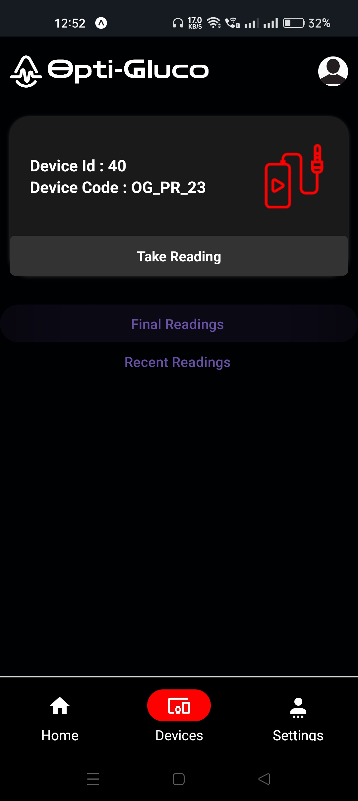

Here's the corrected version of the README file with grammar and spelling mistakes fixed, without changing the format:

# Opti-Gluco: Non-Invasive Blood Glucose Monitoring System

Opti-Gluco is an innovative non-invasive blood glucose monitoring system that enables users to measure their blood sugar levels without the need for painful finger pricking. This project was developed as the main project for my MCA degree, with the aim of providing a convenient and continuous glucose monitoring solution.

## How it Works

The system utilizes a laser light that passes through the user's blood when they place their finger on the device. The transmitted light is then captured as images, which are analyzed using a Convolutional Neural Network (CNN) model for image processing. By analyzing these images, the system can accurately determine the user's current blood glucose level and provide the sugar level range as output.

## Technologies Used

- Hardware: Raspberry Pi
- Operating System: Raspbian OS
- Back-end: Node.js, Express.js, Flask
- Front-end: React Native (for user interface)
- Image Processing: Convolutional Neural Network (CNN)

## Versions

- node: v18.16.0
- expo: 50.0.7

## Key Features

- Non-invasive and continuous glucose monitoring
- Eliminates the need for finger pricking
- Accurate blood glucose level measurements
- User-friendly interface for easy monitoring
- Utilizes advanced image processing techniques (CNN)
- Portable and compact design

## Backend

In this project, three servers are developed for implementing backend functionalities.

1. A NodeJS server called the Main server acts as a bridge between the IoT device and the user.
2. Another Node.js server integrated on the IoT device to enable communication between the user and the device.
3. A third Flask server to handle the machine learning side of the project.

## Frontend

In this project, the frontend is done with React Native, and through this mobile app, the user can easily interact with the system.

## Databases

In this project, PostgreSQL and SQLite 3 are used as databases.

- PostgreSQL is used in the main server.
- SQLite is used in the server integrated into the IoT device.
- Sequelize is used as an ORM.

## Getting Started

To get started with opti-gluco, follow the instructions in this Installation Guide.

- First, install all the project dependencies for each server.
- The servers are in the following folders:
  1. `MainServer`
  2. `IotServer`
  3. `ML-server`
- Install project dependencies by using the command `npm install`.

To start the React Native application:

- First, enter the `SampleApp` folder.
- Install the project dependencies.
- Install and set up the expo-cli as per the expo's documentation.

## Run the Project

- Power the IoT device.
- Start all the Node servers using the command `npm start`.
- Start the Flask server using the command `python app.py`.
- Start the Expo using the command `npx expo start`.

# Screen shots

   
 
